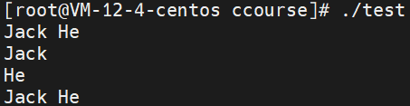
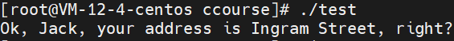
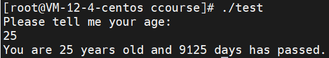
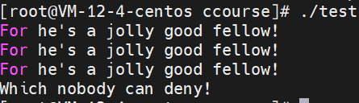
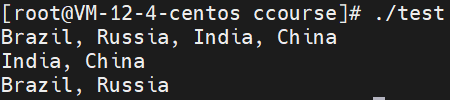
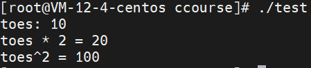
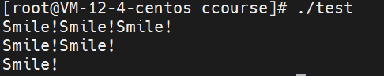
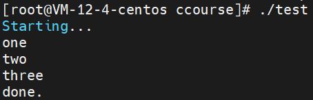

c primer plus练习题
<center>章节二</center>
------------------
<font face="楷体">1.编写一个程序，调用一次printf() 函数，把你的名和姓打印在一行。再调用一次printf() 函数， 把你的名和姓分别打印在两行。然后，再调用两次printf() 函数，把你的名和姓打印在一行。 输出应如下所示（当然要把示例的内容换成你的名字）：
Gustav Mahler←第1次打印的内容
Gustav←第2次打印的内容
Mahler←仍是第2次打印的内容
Gustav Mahler ← 第3次和第4次打印的内容

```C
#include<stdio.h>

int main() {

    printf("Jack He\n");
    printf("Jack\nHe\n");
    printf("Jack ");
    printf("He\n");
    return 0;
}
```


2.编写一个程序，打印姓名和地址
```C
#include<stdio.h>

int main() {

    char *name = "Jack";
    char *address = "Ingram Street";
    printf("Ok, %s, your address is %s, right?\n", name, address);
    return 0;
}
```

上面用到了字符串的知识点

3.编写一个转换年龄为天数的程序，并且两个都显示，不考虑闰年。
```C
#include<stdio.h>

int main() {

    int age;
    printf("Please tell me your age:\n");
    scanf("%d", &age);
    printf("You are %d years old and %d days has passed.\n", age, age*365);
    return 0;
}
```


4.编写一个程序，生成以下输出：
For he's a jolly good fellow!
For he's a jolly good fellow!
For he's a jolly good fellow!
Which nobody can deny!
除了main函数，程序调用两个自定义函数，一个是打印前三条语句的jolly函数，调用一次打印一次，另一个是打印最后一条语句的deny函数
```C
#include<stdio.h>

void jolly() {
    printf("For he's a jolly good fellow!\n");
}

void deny() {
    printf("Which nobody can deny!\n");
}

int main() {

    jolly();jolly();jolly();
    deny();
    return 0;
}
```


5.编写程序，生成以下输出：
Brazil, Russia, India, China
India, China
Brazil, Russia
除了main函数外，程序需要调用两个函数，一个是输出"Brazil, Russia"的br函数，另一个是输出"India, China"的ic函数，其他在main中完成。
```C
#include<stdio.h>

void br() {
    printf("Brazil, Russia");
}

void ic() {
    printf("India, China\n");
}

int main() {

    br();
    printf(", ");ic();
    ic();
    br();printf("\n");
    return 0;
}
```


6.编写程序，创建整型变量toes，并初始化为10，程序需要输出toes的值、toes的两倍值和toes的平方值，辅以描述进行区分。
```C
#include<stdio.h>

int main() {

    int toes = 10;
    printf("toes: %d\ntoes * 2 = %d\ntoes^2 = %d\n", toes, toes*2, toes*toes);
    return 0;
}
```


7.编写程序，输出以下语句：
Smile! Smile! Smile!
Smile! Smile!
Smile!
定义函数输出"Smile!"
```C
//最简单粗暴的例子
#include<stdio.h>

void smile() {
    printf("Smile");
}

int main() {

    smile();smile();smile();printf("\n");
    smile();smile();printf("\n");
    smile();printf("\n");
    return 0;
}

//稍微玩点花样，加入loop
#include<stdio.h>

int main() {

    int i,j;
    for (i=0; i<3; i++) {
        for (j=2; j>=i; j--)
            printf("Smile!");
        printf("\n");
    }
    return 0;
}
//这里加进去的是for循环的知识
```


8.编写程序，main函数输出"Starting..."，然后调用自定义one_three函数，函数输出"one"，然后调用自定义函数two，函数输出"two"，one_three函数调用two函数完毕后输出"three"，最后main函数输出"done"，输出如下：
Starting...
one
two
three
done.
```C
//和上面的例子不同，这里采用了函数前置声明，在main以后进行实现
#include<stdio.h>

void two();

void one_three();

int main() {

    printf("Starting...\n");
    one_three();
    printf("done.\n");
    return 0;
}

void two() {
    printf("two\n");
}

void one_three() {
    printf("one\n");
    two();
    printf("three\n");
}
```


其实书本中的一些题目描述让我觉得很迷，但幸好有一个输出效果的样板在那里，其实很多时候就是这样的，一些需求的到来就是很迷，但你需要找一个类似的效果作为参考，如果听上面的描述，很自然的就会觉得犯迷糊的；另外，就我一直以来的学习，我都觉得c/c++的一些学习练习都是很考究数学能力的，这点我很喜欢，但你如果想要把它落到实处地使用，可能不会符合你的需要，书本给你的始终是脱离生产和生活的，如果你有个点子，实现它，但书本不会有太多参考，fight。