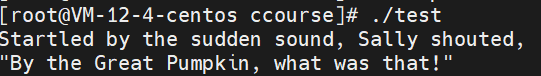
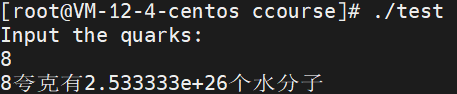

c primer plus练习题
<center>章节二</center>
------------------
<font face="楷体">
1.设计满足系统的上溢下溢现象的程序
这个我在整理的时候就有了类似的例子，这里进行统一一下下
```C
#include<stdio.h>

int main() {

    //整型
    int i = 2147483647;
    printf("原值：%d，整型溢出现场：%d\n", i, i+1);
    unsigned j = 4294967295;
    printf("原值：%u，无符号整型溢出：%u\n", j, j+1);
    //浮点型
    printf("浮点型溢出现场\n");
    float big = 3.4e38, small = 3.4e-38;
    printf("原值：%f，上溢：%f\n", big, big*2);
    printf("原值：%.38f，下溢：%.38f\n", small, small/2);
    return 0;
}
```


2.编写程序，输入一个ASCII值（整型数值，如66），输出对应字符
```C
#include<stdio.h>

int main() {

    int v;
    printf("Please input value of ascii：\n");
    scanf("%d", &v);
    printf("The character of %d is %c\n", v, v);
    return 0;
}
```

**转换符%c表示输出字符，对应整型变量时输出的是ascii码中对应字符；
转换符%d表示输出十进制整数，对应字符变量时输出ascii码对应值，也就是序号**

3.编写程序发出警告并输出下面文本：

Startled by the sudden sound, Sally shouted,
"By the Great Pumpkin, what was that!"

```C
#include<stdio.h>

int main() {

    printf("\aStartled by the sudden sound, Sally shouted,\n");
    printf("\"By the Great Pumpkin, what was that!\"\n");
    return 0;
}
```

这里考核的是转移序列和转义符的使用，一定要在本机进行练习，不然程序执行的铃声你不一定能听到(使用云主机的情况下)

4.编写程序，读取浮点数，输出带小数点的和科学计数法表示的实数，当系统支持，输出十六进制浮点数
```C
#include<stdio.h>

int main() {

    float i;
    printf("Please input the actual number：\n");
    scanf("%f", &i);
    printf("%f, %e\n", i, i);
    printf("hex: %a\n", i);
    return 0;
}
```


5.编写程序，提示用户输入年龄，然后显示年龄对应秒数（一年大约有3.156x$10^7$秒）

```C
#include<stdio.h>

int main() {

    int age;
    float sec_each_year = 3.156e7;
    printf("Input your age:\n");
    scanf("%d", &age);
    printf("It has passed %f sec since you were born.\n", age*sec_each_year);
    return 0;
}
```


6.水分子质量为3.0x10^-23克，一夸克大约是950克，编写程序，提示用户输入夸克数，然后输出对应水分子数量。

```C
#include<stdio.h>

int main() {

    int quark, quark_each_gram = 950;
    float num_each_gram = 3.0e-23;
    printf("Input the quarks:\n");
    scanf("%d", &quark);
    printf("%d夸克有%e个水分子\n", quark, quark*quark_each_gram/
           num_each_gram);
    return 0;
}
```


7.1英寸相当于2.54厘米，编写程序，根据输入厘米为单位的身高数值，输出英寸为单位的身高数值。
```C
#include<stdio.h>

int main() {

    float centimetre_each_inch = 2.54, height;
    printf("Input your height: \n");
    scanf("%f", &height);
    printf("%f cm, %f inch\n", height, height/centimetre_each_inch);
    return 0;
}
```
因为我国使用的量度单位为厘米，所以我更改题目，输出如下：


8.和上面的类似，更类似描述题，不叙。