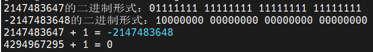
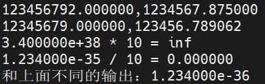

author: Jack
time:   2022/10/12
---------------

对于程序而言，非常重要的就是数据的保存和使用，长期固定不变的数据称为常量，比如个人生日、身份证号等，但也有时常变动的数据，比如人的身高，这就是变量，但不管是常量还是变量，它们都会有一个类别归属，就是数据的类型

### 一、数据类型

#### <font face="楷体">整数类型和浮点类型
>简单区分就是有无小数点，没有小数点的当然是整数，有小数点的是浮点数
根据数值大小，整数类型如下：
int类型：   取值范围为-32768至32767之间，早期占用16位，现在用32位来存储一个int值；常见的c语言考核溢出，就是理论上最大值32767给加一，即2的15次方减一的值加一，那就满上了，连带着存储正负的符号位也置换了(因为机器是二进制)，然后计算机识别出来的值就是-32768了，更改后的32位存储也使得取值范围变为-2147483648至2147483647之间，对应的输出转换符为%d。

另外的整数类型有短整型和长整型，如下：
* short int类型， 占用8-16位字节，具体看硬件支持，输出的转换符为%hd；
* long类型或者long int， 占用比int多，输出的转换符为%ld；
* long long或者long long int 类型， 至少占用64位，对应C99标准及其后面的版本，输出的转换符为%lld；
>> 1.在C标准中，只规定了short占用存储不能多于int，而long占用不能少于int，所以具体情况需要看平台支持。常见的设置有long long占64位，long占32位，short占16位，而int占16或者32位。
2.上面的都是有符号类型，无符号类型则不同，它们没有负数，比如unsigned int就是无符号整型，取值范围为0-65537或者0-4294967296，同样的比如unsigned short int(unsigned short)表示短整型，而C99以后针对长长整型(我嘴贱喜欢这么叫)添加的无符号长整型则为unsigned long long int(或者unsigned long long)，它们的输出转换符统一加u，比如int类型为%u，short为%hu，long为%lu，同样的long long为%llu；
要知道和无符号类型相反，在符号类型关键字前添加signed则表示强调此为有符号整型，很多关键字都表示强调，在特定场合有关键作用，牢记。

关于整型的溢出例子如下：
```C
#include<stdio.h>
#include<math.h>

//十进制转换二进制输出函数
void inttobit(int n, int x) {
    int i;
    for (i = n -1;i >= 0;i--) {
        int temp = x;
        temp = x&(1<<i);
        (((i + 1)%8 == 0)&&(i!=31))?printf(" %d", temp>>i):printf("%d", abs(temp>>i));
    }
    printf("\n");
}

int main() {
    int i = 2147483647, i_;
    unsigned int j = 4294967295;
    i_ = i + 1;
    printf("%d的二进制形式：", i);
    inttobit(32, i);
    printf("%d的二进制形式：", i_);
    inttobit(32, i_);
    printf("%d + 1 = %d\n", i, i_);
    printf("%u + 1 = %u\n", j, j+1);
    return 0;
}
```

输出效果如下：

c primer plus里面有个有意思的说法：**把取值范围当做里程表，当值达到最大，就会重新从起点开始，无符号和有符号的区别在于前者是从0开始而有符号是从-2147483648开始，而且这类属于操作不当而不是error或者warning**

强调了整型，该了解一下浮点型了
**float、double 和 long double**
作为存储实数这种数据的数据类型，浮点型的表示是使用科学计数法的类似方法，用于表示非常大或者非常小的数，因为计算机的存储是二进制，所以保存使用的科学计数法是a*2^b这样的形式。
* float类型， 至少能表示6位有效数字，取值范围是1.e-37~1.e+37；
* double类型， 至少能表示10位有效数字，最小取值范围和float类型相同
* 其实这里的有效数字让我很迷，还需要慢慢磨一下
* long double类型， 但精度和double一致，
* 浮点型的十进制格式的输出转换符为%f，指数计数法表示的输出转换符为%e，需要注意的是long double类型的输出转换符为%Lf、%Le。
#### 浮点型的上溢和下溢
和整型数据的溢出一样，但浮点型变量存值为最大值时，继续做增值运算就会出现溢出现象，而最大值做乘法，出现的溢出就是上溢，最小值做除法，出现的溢出就是下溢，后者的情况更为复杂，但大多是丢失精度。
```C
#include<stdio.h>

int main() {

    float a = 123456789.0, b = 1234567.89;
    float c = 12345678.9, d = 123456.789;
    float big = 3.4e38, small = 0.1234e-34;
    printf("%f,%f\n", a, b);
    printf("%f,%f\n", c, d);
    printf("%e * 10 = %f\n", big, big*10);
    printf("%e / 10 = %f\n%", small, small/10);
    printf("和上面不同的输出：%e\n", small/10);
    return 0;
}
```
输出结果如下：

可以看到的就是上溢得到的值是inf，这个是现在的规定中的一个表示无穷大的值，而下溢的输出就有意思了，十进制的输出是一大串0，这是计算机存值的时候不够小数位来完成正确运算，但在科学计数法显示又是正常的，因为这种计算需要的小数位不多。（暂时这么解释）

**接着上面的inf这个特殊值，其实还存在一个NaN的特殊值，表示not a number，比如C库中的asin函数用作返回正弦值的对应角度，当它的传入参数为-1~1以外的值时，这个函数无法得出正常值，这种未定义行为得到的值就是NaN。**

#### 关于数据的不同形式的输出

>>这里是想针对想要不同形式的输出的，关于输出转换符的一个知识点
我们往常见到的往往是十进制的数，但偶尔也会有关于八进制和十六进制的输出需求，这时候我们可以使用C语言内置的输出转换符来对输出形式进行限定。比如%o表示八进制整数的输出，%x表示十六进制的整数输出，为了突出显示数据的进制形式，会有特殊的前缀进行标识，这就需要在转换符中添加#提示计算机，比如%#o、%#x和%#X。
但C语言没有内置的二进制输出机制，大多需要自己实现

>>关于实数，我们输出的时候常常有一个精度需求，即输出到小数点后几位，这种需求也是可以通过输出转换符来实现，比如%.3f就表示显示小数点后三位数。
同样的，当系统支持输出十六进制浮点数时，可以使用a或者A来代替输出转换符中的e或者E，即%a(%A)。

```C
//整型
int num = 100;
printf("十进制：%#d，八进制：%#o，十六进制：%#x,%#X\n",num,num,num,num);
//result
十进制：100，八进制：0144，十六进制：0x64,0X64

//浮点型
float a = 1234.5678;
printf("%.3a\n",a);
//result
0x1.34ap+10
```

#### 特殊的复数和虚数类型
C99标准以后，有所保留地对复数和虚数表示支持，所以在很多我国的考试是否认复数类型的存在的，因为它不通用，比如在嵌入式里面就没有实现，这个作为一个C语言的练习，自己实现一个复数类型或者虚数类型(在学习了struct以后就可以进行了)。

* 复数类型：float_Complex、double_Complex和long double_Complex
* 虚数类型：float_Imaginary、double_Imaginary和long double_Imaginary
* 在complex.h头文件中，有关于complex的声明可以代替_Complex，imaginary代替_Imaginary，I代替-1的平方根

## 二、重要的字符类型

诸如字母、标点符号、汉字等都是字符，但C在早期发展并没有把汉语纳入字符的行列，所以它的字符包括的是字母和一些标点符号，另外基于它的存储大小而言，它能表示的也字符集也比较有限，即标准ASCII码0~127的范围，用7位二进制数即可达到目标。

标准ASCII码包括大小写字母52个和其他字符，C中表示字符常量需要以''括起来进行标记，一个字母、一个符号就是一个字符常量，需要注意。