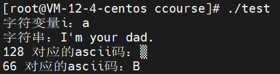
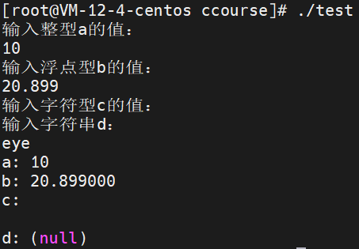
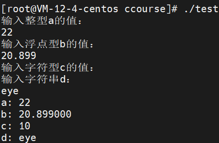
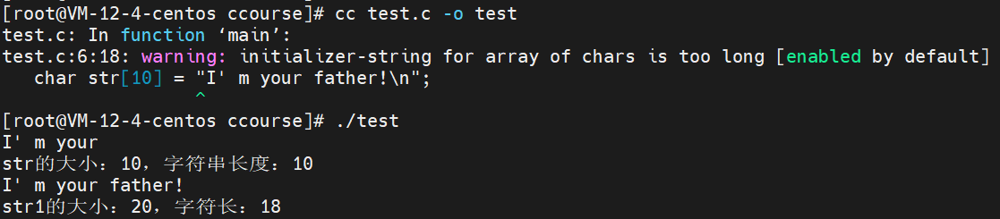
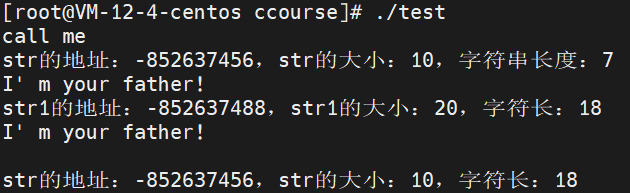
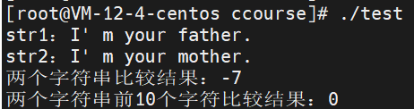
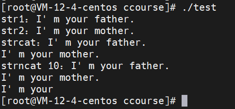

<font face="楷体">关于字符，就是英文字母、标点符号，即a、h、+等，一个字符串就是字符组成的串联，比如"I'm your dad!"、"lksdjao函健康的搜集覅人事"，可惜的是早期的C只支持ASCII字符集，即大小写英文字母和一些标点符号还有特殊符号共计128个，在后面发展，慢慢有了支持其他语言字符的字符集，想ISO和utf-8等，这些在比较新的语言上面就能看到非常好的支持，算是吃了体制比较完善的红利吧。

**所以其实这里有个问题，当我们使用printf函数来进行输出的时候，我们输出带有中文的字符串是可以正常输出的，但C明显是不支持中文字符的，为何存储和读取的时候不会乱码呢？这个问题可以留着，带着疑问去学习记录效果会很好。**

## 一、字符和字符串

C中只支持字符类型而不支持字符串类型，char类型，占用一字节、8bit内存，它的存值大小决定了它对应的字符集，像我知道的go，它就直接放弃了字符类型，支持字符串类型，并且对应的字符集也是非常全的utf-8标准。

字符及字符串定义
```C
//字符型变量的声明和初始化
char i = 'a';
//字符串的声明和初始化
char *str = "I' m your dad!\n";
int a = 128, b = 66;
printf("字符变量i：%c\n", i);
printf("字符串：%s", str);
//当输出字符超出ascii表范围时会显示乱码
printf("%d 对应的ascii码：%c\n", a, a);
printf("%d 对应的ascii码：%c\n", b, b);
```


简单的声明一个字符型变量，就是类型+变量名即可，但要声明一个字符串变量就需要在变量名前加*，这部分涉及到了指针，先不加以描述，但要记住这个声明方式。它的初始化也和正常的变量初始化一致，变量名+等号+常量即可。

前面的都是既定输出，变量基本都是确定了的，但偶尔看到的scanf语句却能够通过输入给变量赋值，给程序引入了变化，这是最有意思的，因为既定的走向就是死水，有了变化才会精彩。

关于scanf语句，菜鸟教程给出的原型是这样的：
```C
int scanf(const char *format, ...)
```
这个是最常用的读取输入的函数，它能从我们的输入中读取所需数据，我们的输入被称为标准化输入，既然有输入当然就有输出了，是的，还有个专有名词：标准化输出，另外还有个标准化错误输出(没有标准化错误输入，手动doge)，这里的format参数基本都是带有%标签的参数构成的格式化字符串，常见的有%c标记字符，%s标记字符串，%d标记整型数据，%f标记浮点型数据，后面的...代表变量地址，所以一般都会在变量名前添加&运算符来进行地址取值，但字符串变量不用。
```C
//整型
int a;
printf("输入整型a的值：\n");
scanf("%d", &a);

//浮点型
float b;
printf("输入浮点型b的值：\n");
scanf("%f", &b);

//字符型和字符串型
char c, *d;
printf("输入字符型c的值：\n");
scanf("%c", &c);
printf("输入字符串d：\n");
scanf("%s", d);
```
关于scanf的简单使用如上所示，单个拿出来都能正常运行，但全部放在一个c文件中，所编译运行的程序就不能如期运行了。现象如下：

scanf函数的调用是把我们输入的数据保存到缓冲区中，这样就会形成一个格式字符串，而scanf函数的结束调用往往是在接收到空白字符(换行\n、水平制表\t、回车\r、空格\b)的时候，而整型和浮点型的调用会在识别到空白字符的时候停止，把空白字符留在输入缓存中，当scanf是连续调用的时候，尤其是调用来对字符型进行输入时，往往会把前面留在缓存中的空白符读取，所以就出现了上面的字符型变量初始化为'\n'，因此printf会输出两次换行(我给程序添加了输出一个变量和其值就换行的printf语句)，至于后面的字符串变量为何会出现没有初始化的情况，则是因为同样是scanf遇到输入的字符中的空白导致直接停止调用而没有给字符串变量赋值初始化，但让我不明白的是，如果在上面程序中穿插其他变量赋值初始化的话，字符串变量却是能够正常初始化的。
```C
//整型
  int a, num;
  printf("输入整型a的值：\n");
  scanf("%d", &a);

  //浮点型
  float b;
  printf("输入浮点型b的值：\n");
  scanf("%f", &b);
  num = 10;

  //字符型和字符串型
  char c, *d;
  printf("输入字符型c的值：\n");
  scanf("%c", &c);
  printf("输入字符串d：\n");
  scanf("%s", d);
  //printf("字符串变量的初始化结果：%d\n", num);
  printf("a: %d\nb: %f\nc: %d\nd: %s\n", a, b, c, d);
```


## 二、字符串的其他声明

上面有提到字符串的声明是如下样式：
```C
char *str = "Nazume Takashi"
```
这实际上是声明了一个char类型的指针，并初始化为"Nazume Takashi"的字符串，这个指针str的值就是一个地址，它在初始化以后指向的是存储"Nazume Takashi"字符串的地址，因为是地址，在使用scanf进行赋值初始化时就不需要使用&进行取址运算，这就是指针。除此以外，还可以用创建字符数组的方式来存储字符串，如下：
```C
char str[] = "balabala";
char str1[30] = "Never, never, never give up!";
```
上面的str是没有显式声明字符串变量长度，后面的str1是显式确定了字符串长度为30字节的字符串，它们都是char类型的数组，数组就是同类型数据的连续序列，所以存储的时候也是由连续的存储单元组成，基础单元就是其类型的存储大小。另外，数组也是指针，str和str1完全可以作为指针来使用，指针是C的一大特性和重点掌握的内容，基本搞定了指针，C也就搞定了。

>关于字符串，可以知道的是，在C中，只存在字符类型而不存在字符串类型，字符串往往是字符类型序列，也就是连续的字符串类型，而对于字符串，往往是按照需要来确定字符串长度的，也就是非定式的，那如何确定边界？在C中，字符串以'\0'表示空字符，而在字符串结束的时候，会以'\0'作为结束标志，所以一般来说，字符串初始化需要在末尾加上'\0'，而我们常用的scanf会在字符串赋值时完成这项工作，所以有时候我们处理字符串会忘记这个重要步骤。
>>字符串显式声明确定了其存储大小后，它的容量就确定了，就是n-1个字符，但在实际的生活中并不能确保这个容量够用，当要存储的字符串超出了其容量会如何？比如字符串"I' m your father!\n"就包含了18个字符，所以存储这个字符串的字符数组大小应该是19位才行，如果将它存到大小为10位的字符数组会如何？
```C
//容量不足的str
char str[10] = "I' m your father!\n";
//容量足够存储的str1
char str1[20] = "I' m your father!\n";
printf("%s", str);
//sizeof可以查看占用内存大小，strlen查看实际存储了字符串长度(排除'\0')
printf("\nstr的大小：%d，字符串长度：%d\n", sizeof(str), strlen(str));
printf("%s", str1);
printf("str1的大小：%d，字符长：%d\n", sizeof(str1), strlen(str1));
```

可以明显看到，编译生成可运行文件的时候编译器报警了，一个关于"初始化字符串过长"的warning(warning不影响可执行文件生成，error会阻止可执行文件生成，但warning指明程序运行可能会出现意料之外的问题)，从运行结果来看，str在存储过长字符串时出现截取的现象，而且字符串占满了内存空间，而str1能够完全存下相同字符串且还有剩余空间(实占18，还有两位存储剩余)；另外，当我们活用'\0'，那就可以存储我们需要的特定字符串从而达到切割的效果。

## 三、字符串处理

就目前而言，涉及的都是字符串的声明定义，可以说是静态的字符串使用，实际上，生产中往往需要对字符串进行各种各样的处理，总结起来就是：复制、切割、拼接、截取、各种判断转换。需要注意的是，下面函数原型都出自C标准库中的string.h头文件，函数调用需要在文件开始引入头文件。
```C
#include <string.h>
```

#### 复制
```C
char *strcpy(char *dest, const char *src)
//一般都不适用返回参数，返回参数是类似dest的字符指针或者限定大小的字符数组
```
>>如上，src是待复制字符串，一般是常量字符串或者已经初始化的字符串变量的指针，而dest则是目标字符串，即复制字符串的存储地址(一般是未初始化且存储空间充足)，函数是把src存储或指示的字符串给复制到dest位置。注意，当dest字符串已经初始化的情况下调用strcpy函数，会导致之前的存值被新值覆盖，另一方面，如果dest的容量比src指示的字符串长度要小，它还是能够复制，且dest的大小不变，但用strlen检查，字符串已经溢出dest指示的地址范围。


**上面的例子都是在linux系统中进行尝试的，如果是在windows的vs进行实验，往往会报错，显示strcpy不安全，让你另外选择安全类型的字符串复制函数，这种安全函数是vs内部实现的，这种就是针对硬件平台的不同C支持**

#### 比较

```C
int strcmp(const char *str1, const char *str2)
int strncmp(const char *str1, const char *str2, size_t n)
```
>>* 和上面strcpy一样，strcmp接收两个字符型指针或者字符数组的地址作为函数参数，它比较str1和str2的字符串是否相同，当返回值为0时两者相同，当它们有第一个不同字符对可以比较该字符对在字符集的排位来进行函数输出；
>>* 而strncmp同样能比对字符串，第三位参数使得它们可以有选择地进行比对，比如n为8，那就是比对str1和str2的前8个字符是否相同，输出和strcmp一致。

可以看到使用strcmp进行比对两个字符串，str1的"father"和str2的"mother"不同，而f比m在ASCII表中的位置要前，大概是7个单位，所以是-7输出；strncmp比对前10个字符没有不同，所以输出0。

#### 拼接

```C
char *strcat(char *dest, const char *src)
char *strncat(char *dest, const char *src, size_t n)
````
>>* 类似，拼接函数的调用同样需要两个传参，把src字符串拼接到dest指示字符串末尾，不同的是，后者strncat能够有选择性地拼接字符串，如下：

上面就是两个拼接函数的调用例子，它们的传入参数都是str1和str2，不过是拼接两次，第一次是strcat全拼接，第二次是strncat选择性拼接str2的前面10个字符到str1上面。要注意的是，这个拼接也需要考虑变量存储大小，如果容量不足，程序运行就会出现Segmentation fault错误，这是表示程序访问越界，为了防止这种问题的发生需要为最终字符串留有足够的空间来进行存储，一般我们传入的参数都是规定大小的数组，如果用的是常字符型指针，因为它是根据初始化的字符串来划分大小，所以当它用于拼接，就会出现Segmentation fault，因为它的大小已经定死了，没有多余的空间给新来的字符串。