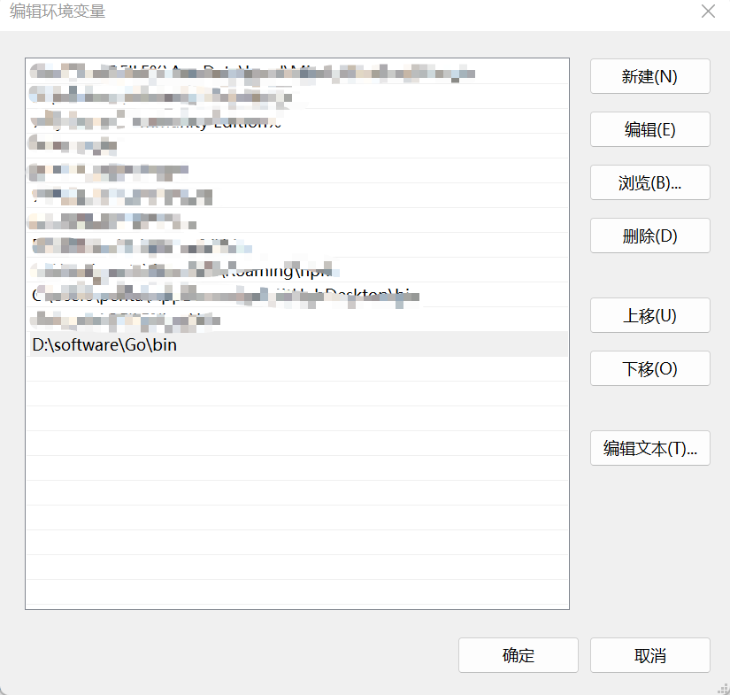

<font face="楷体">
背靠国外各大金主的go语言，在各种推动下，可谓是新的弄潮儿，但国内虽然各种推销，但从安装到开发再到维护，资料都少之又少，可能被垄断了解释权吧。
因此下面的也只是一个记录而已，是一次仅限于本人本机本阶段的成功尝试。

## 一、win11下golang安装

go语言有个人社区，但在国外，访问起来等同于访问google，连通性几乎不计，所以我的安装来源是go语言中文网。如下：

[go语言中文网](https://studygolang.com/dl "go语言中文网下载跳转")

好像这个也可以

[go官网下载页面](https://golang.google.cn/dl)

如下，目前已经是go1.19版本了，选择windows的installer选项，点击下载msi包，这样更加简单，因为下载来的是一个安装软件(注意版本，所说现在基本都是64位系统了)。


点击运行安装软件，安装步骤如下，跟流程即可：


因为我已经安装了，这次是卸载重装，没有安装过的是不会有这个页面的


后面基本流程就是"同意协议"、"选中安装路径"，然后就是等待安装完成了。


到了这里就算安装完成了，但go的安装并不会帮我们配置环境路径，所以我们需要自己配置。

【设置】-【系统信息】-【高级系统设置】，然后点击【环境变量】，电脑一般都是自己用，没有设置多用户，而且安装也是在本用户中进行，所以直接编辑用户变量即可。
点击PATH变量然后添加刚才的go的可执行文件即可(就是go.exe所在路径)，步骤如下：




以上步骤完成以后，系统就"知道"我们有了个go的可运行软件，让我们打开命令行界面来检查一下安装结果吧。
【win+r】快捷键输入"cmd"，打开命令行，然后输入命令，检查go版本。结果如下：
```shell
C:\Users\user>go version
go version go1.19.2 windows/amd64

C:\Users\user>
```
可见，go版本为最新的1.19.2，正好是我们安装的，这样就算安装完成了，然后测试一下使用，来个简单的test.go。

```go
package main

import "fmt"

func main() {
    fmt.Println("Hello, I'm your father.")
}
```

简单运行一下，有两种方式，一种是直接运行，一种是编译生成可执行文件，然后运行可执行文件。如下：

```shell
PS D:\Desktop> go run test.go
Hello, I' m your father.
PS D:\Desktop> go build test.go
PS D:\Desktop> ./test
Hello, I' m your father.
PS D:\Desktop>
```

## 二、配置go开发环境

**配置GOPATH和GOROOT**

GOPATH是go的项目路径，用来放一些个人库、编译文件和源码；GOROOT就是go的安装路径即可，这个是go的一些标准库、编译软件和一些重要软件的位置。同样是编辑环境变量来进行吧。

如下添加即可：


有时候修改结束不会马上有结果，我们可以在命令行窗口输入go env命令查看一下，这个是检查go的环境参数的一个命令，如果没有修改那就需要重启一下电脑再来看。

然后修改go代理，因为国内访问不到，需要另外一个地址，cmd上面进行修改

```shell
PS D:\Desktop> go env
set GO111MODULE=off
set GOARCH=amd64
set GOBIN=
set GOCACHE=C:\Users\penta\AppData\Local\go-build
set GOENV=C:\Users\penta\AppData\Roaming\go\env
set GOEXE=.exe
set GOEXPERIMENT=
set GOFLAGS=
set GOHOSTARCH=amd64
set GOHOSTOS=windows
set GOINSECURE=
set GOMODCACHE=D:\documents\gocourse\pkg\mod
set GONOPROXY=
set GONOSUMDB=
set GOOS=windows
set GOPATH=D:\documents\gocourse
set GOPRIVATE=
set GOPROXY=https://proxy.golang.org,direct
set GOROOT=D:\software\go
set GOSUMDB=sum.golang.org
set GOTMPDIR=
set GOTOOLDIR=D:\software\go\pkg\tool\windows_amd64
set GOVCS=
set GOVERSION=go1.18.7
...
PS D:\Desktop> go env -w GOPROXY=https://goproxy.cn,direct
PS D:\Desktop> go env
...
set GOPROXY=https://goproxy.cn,direct
...
PS D:\Desktop>
```
go env是查看go的一个配置命令，使用go env -w是重写其中的配置，当你开始修改的时候，env文件就会生成在上面GOENV参数指定路径，上面也可以看到修改好了的GOPATH和GOROOT参数。运行了go env -w来修改GOPROXY后可以看到已经修改成需要的代理地址了。go env的参数过多，上面只显示一些需要的参考参数。

## 三、配置vscode环境

听到的主流上，大多数人用的是Jetbrain的goland来进行go的开发调试，不过个人用的是vscode，这里的配置也是针对vscode进行的。

vscode的配置还是比较简单的，总结来说就是安装一个对应插件，还有安装go tools在GOPATH路径下即可。

首先在go插件栏搜索go，找到对应插件，点击安装


安装好以后打开vscode的命令面板(【查看】-【命令面板】)，然后输入go install tools命令，然后全部选中，进行安装，很多时候因为网络问题往往会失败，这是因为很多包都是在github上维护的。


**失败的处理方法**

* 在GOPATH目录下src目录创建golang.org/x目录
* 在新建的x目录下，右键打开终端，然后git clone两个包，主要是输入以下命令
```shell
git clone https://github.com/golang/tools.git
git clone https://github.com/golang/lint.git
```
* 然后回到vscode，再来安装一次，就可以了。

成功后界面如下：
```shell
Tools environment: GOPATH=D:\documents\gocourse
Installing 7 tools at D:\documents\gocourse\bin in module mode.
  gotests
  gomodifytags
  impl
  goplay
  dlv
  staticcheck
  gopls

Installing github.com/cweill/gotests/gotests@latest (D:\documents\gocourse\bin\gotests.exe) SUCCEEDED
Installing github.com/fatih/gomodifytags@latest (D:\documents\gocourse\bin\gomodifytags.exe) SUCCEEDED
Installing github.com/josharian/impl@latest (D:\documents\gocourse\bin\impl.exe) SUCCEEDED
Installing github.com/haya14busa/goplay/cmd/goplay@latest (D:\documents\gocourse\bin\goplay.exe) SUCCEEDED
Installing github.com/go-delve/delve/cmd/dlv@latest (D:\documents\gocourse\bin\dlv.exe) SUCCEEDED
Installing honnef.co/go/tools/cmd/staticcheck@latest (D:\documents\gocourse\bin\staticcheck.exe) SUCCEEDED
Installing golang.org/x/tools/gopls@latest (D:\documents\gocourse\bin\gopls.exe) SUCCEEDED

All tools successfully installed. You are ready to Go. :)
```

新建一个go文件进行测试，看看是否有正常的代码提示和格式化工具即可。