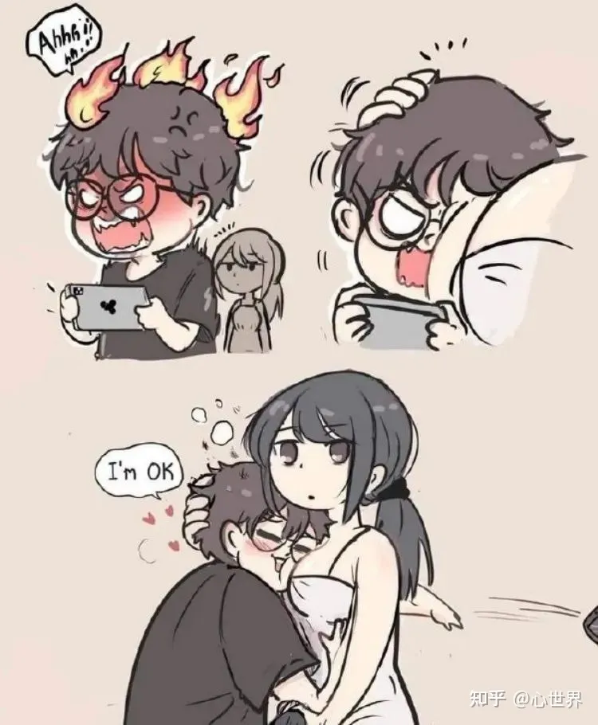
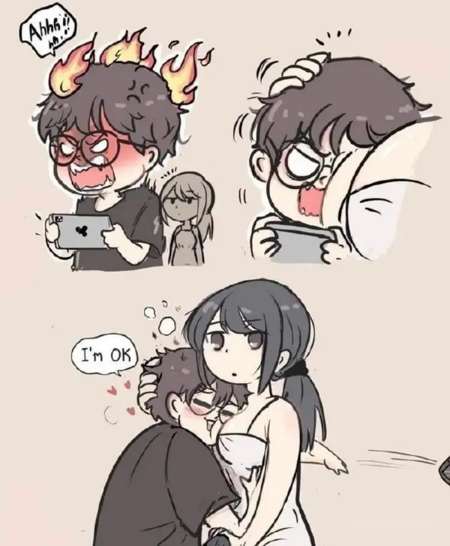
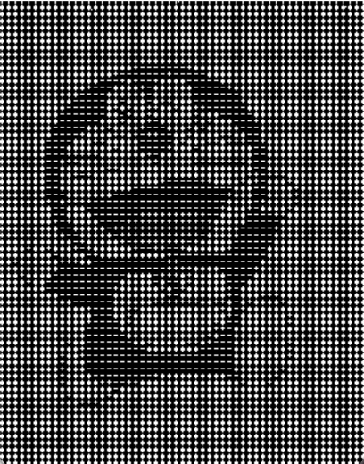

<font face="楷体">
这里是针对的opencv的使用例子，因为看到很多别人的关于视频转换成字符画的实验，心痒难耐，所以专门做一下实验。首先来点简单的吧，先搞python的。

### 视频准备

首先是搞到一个视频，b站资源多，手机先缓存一个，然后找到文件路径，不过找到的含tv、bili的关键字的文件夹下，视频和音频文件是分开的，没办法，只能先合成一下，下载个ffmpeg用一下吧。到github下的官网路径下载好压缩包，添加环境变量应该就好，路径如下：

[github下载](https://github.com/BtbN/FFmpeg-Builds/releases)

选择lgpl那种，简单看了一下两个压缩包，gpl应该是纯软件，lgpl则是带有第三方库的，所以作为developer，还是选后者吧。配好环境变量重启后试一下：
<details>
<summary>检验情况</summary>
<pre><code>
PS D:\Desktop> ffmpeg -version
ffmpeg version N-109036-g10ddbaf514-20221109 Copyright (c) 2000-2022 the FFmpeg developers
built with gcc 12.2.0 (crosstool-NG 1.25.0.90_cf9beb1)
configuration: --prefix=/ffbuild/prefix --pkg-config-flags=--static --pkg-config=pkg-config --cross-prefix=x86_64-w64-mingw32- --arch=x86_64 --target-os=mingw32 --enable-version3 --disable-debug --enable-shared --disable-static --disable-w32threads --enable-pthreads --enable-iconv --enable-libxml2 --enable-zlib --enable-libfreetype --enable-libfribidi --enable-gmp --enable-lzma --enable-fontconfig --enable-libvorbis --enable-opencl --disable-libpulse --enable-libvmaf --disable-libxcb --disable-xlib --enable-amf --enable-libaom --enable-libaribb24 --disable-avisynth --enable-chromaprint --enable-libdav1d --disable-libdavs2 --disable-libfdk-aac --enable-ffnvcodec --enable-cuda-llvm --disable-frei0r --enable-libgme --enable-libkvazaar --enable-libass --enable-libbluray --enable-libjxl --enable-libmp3lame --enable-libopus --enable-librist --enable-libssh --enable-libtheora --enable-libvpx --enable-libwebp --enable-lv2 --disable-libmfx --enable-libvpl --enable-openal --enable-libopencore-amrnb --enable-libopencore-amrwb --enable-libopenh264 --enable-libopenjpeg --enable-libopenmpt --enable-librav1e --disable-librubberband --enable-schannel --enable-sdl2 --enable-libsoxr --enable-libsrt --enable-libsvtav1 --enable-libtwolame --enable-libuavs3d --disable-libdrm --disable-vaapi --disable-libvidstab --enable-vulkan --enable-libshaderc --enable-libplacebo --disable-libx264 --disable-libx265 --disable-libxavs2 --disable-libxvid --enable-libzimg --enable-libzvbi --extra-cflags=-DLIBTWOLAME_STATIC --extra-cxxflags= --extra-ldflags=-pthread --extra-ldexeflags= --extra-libs=-lgomp --extra-version=20221109
libavutil      57. 42.100 / 57. 42.100
libavcodec     59. 52.100 / 59. 52.100
libavformat    59. 34.101 / 59. 34.101
libavdevice    59.  8.101 / 59.  8.101
libavfilter     8. 50.100 /  8. 50.100
libswscale      6.  8.112 /  6.  8.112
libswresample   4.  9.100 /  4.  9.100
PS D:\Desktop>
```
</code></pre>
</details>
打开powershell，命令模式下使用ffmpeg，

```ffmpeg -i audio.m4s -i video.m4s -codec copy final.mp4```

<details>
<summary>运行结果</summary>
<pre><code>
PS D:\Desktop> ffmpeg -i audio.mp3 -i video.mp4 -codec copy badapple.mp4
ffmpeg version N-109036-g10ddbaf514-20221109 Copyright (c) 2000-2022 the FFmpeg developers
  built with gcc 12.2.0 (crosstool-NG 1.25.0.90_cf9beb1)
  configuration: --prefix=/ffbuild/prefix --pkg-config-flags=--static --pkg-config=pkg-config --cross-prefix=x86_64-w64-mingw32- --arch=x86_64 --target-os=mingw32 --enable-version3 --disable-debug --enable-shared --disable-static --disable-w32threads --enable-pthreads --enable-iconv --enable-libxml2 --enable-zlib --enable-libfreetype --enable-libfribidi --enable-gmp --enable-lzma --enable-fontconfig --enable-libvorbis --enable-opencl --disable-libpulse --enable-libvmaf --disable-libxcb --disable-xlib --enable-amf --enable-libaom --enable-libaribb24 --disable-avisynth --enable-chromaprint --enable-libdav1d --disable-libdavs2 --disable-libfdk-aac --enable-ffnvcodec --enable-cuda-llvm --disable-frei0r --enable-libgme --enable-libkvazaar --enable-libass --enable-libbluray --enable-libjxl --enable-libmp3lame --enable-libopus --enable-librist --enable-libssh --enable-libtheora --enable-libvpx --enable-libwebp --enable-lv2 --disable-libmfx --enable-libvpl --enable-openal --enable-libopencore-amrnb --enable-libopencore-amrwb --enable-libopenh264 --enable-libopenjpeg --enable-libopenmpt --enable-librav1e --disable-librubberband --enable-schannel --enable-sdl2 --enable-libsoxr --enable-libsrt --enable-libsvtav1 --enable-libtwolame --enable-libuavs3d --disable-libdrm --disable-vaapi --disable-libvidstab --enable-vulkan --enable-libshaderc --enable-libplacebo --disable-libx264 --disable-libx265 --disable-libxavs2 --disable-libxvid --enable-libzimg --enable-libzvbi --extra-cflags=-DLIBTWOLAME_STATIC --extra-cxxflags= --extra-ldflags=-pthread --extra-ldexeflags= --extra-libs=-lgomp --extra-version=20221109
  libavutil      57. 42.100 / 57. 42.100
  libavcodec     59. 52.100 / 59. 52.100
  libavformat    59. 34.101 / 59. 34.101
  libavdevice    59.  8.101 / 59.  8.101
  libavfilter     8. 50.100 /  8. 50.100
  libswscale      6.  8.112 /  6.  8.112
  libswresample   4.  9.100 /  4.  9.100
Input #0, mov,mp4,m4a,3gp,3g2,mj2, from 'audio.mp3':
  Metadata:
    major_brand     : iso5
    minor_version   : 1
    compatible_brands: avc1iso5dsmsmsixdash
    encoder         : Lavf57.71.100
    description     : Packed by Bilibili XCoder v2.0.2
  Duration: 00:03:52.19, start: 0.000000, bitrate: 132 kb/s
  Stream #0:0[0x2](und): Audio: aac (LC) (mp4a / 0x6134706D), 48000 Hz, stereo, fltp, 2 kb/s (default)
    Metadata:
      handler_name    : SoundHandler
      vendor_id       : [0][0][0][0]
Input #1, mov,mp4,m4a,3gp,3g2,mj2, from 'video.mp4':
  Metadata:
    major_brand     : iso5
    minor_version   : 1
    compatible_brands: iso5dsmsmsixdash
    encoder         : Lavf58.29.100
    description     : Packed by Bilibili XCoder v2.0.2
  Duration: 00:03:52.13, start: 0.000000, bitrate: 292 kb/s
  Stream #1:0[0x1](und): Video: hevc (Main) (hev1 / 0x31766568), yuv420p(tv, bt709), 1920x1080 [SAR 1:1 DAR 16:9], 4 kb/s, 30 fps, 30 tbr, 16k tbn (default)
    Metadata:
      handler_name    : VideoHandler
      vendor_id       : [0][0][0][0]
Output #0, mp4, to 'badapple.mp4':
  Metadata:
    major_brand     : iso5
    minor_version   : 1
    compatible_brands: avc1iso5dsmsmsixdash
    description     : Packed by Bilibili XCoder v2.0.2
    encoder         : Lavf59.34.101
  Stream #0:0(und): Video: hevc (Main) (hev1 / 0x31766568), yuv420p(tv, bt709), 1920x1080 [SAR 1:1 DAR 16:9], q=2-31, 4 kb/s, 30 fps, 30 tbr, 16k tbn (default)
    Metadata:
      handler_name    : VideoHandler
      vendor_id       : [0][0][0][0]
  Stream #0:1(und): Audio: aac (LC) (mp4a / 0x6134706D), 48000 Hz, stereo, fltp, 2 kb/s (default)
    Metadata:
      handler_name    : SoundHandler
      vendor_id       : [0][0][0][0]
Stream mapping:
  Stream #1:0 -> #0:0 (copy)
  Stream #0:0 -> #0:1 (copy)
Press [q] to stop, [?] for help
frame= 6964 fps=0.0 q=-1.0 Lsize=   12208kB time=00:03:52.17 bitrate= 430.8kbits/s speed=5.08e+03x
video:8205kB audio:3715kB subtitle:0kB other streams:0kB global headers:0kB muxing overhead: 2.412839%
PS D:\Desktop>
</code></pre>
</details>

### opencv第三方库的使用

嗯，视频有了，那现在就开始玩耍吧。先搞个opencv的第三方库，
```pip install opencv-python```

#### opencv的图像操作

以下操作练习，基本在交互界面进行，当程序成体系后再直接运行代码。

**读取和显示**

```python
import cv2

img = cv2.imread("D:\img\coder.png")
cv2.imshow("名字", img)
#此函数调用输入参数0表示无限等待键盘输入，这样照片就一直显示，而不是一闪而过
cv2.waitKey(0)
cv2.destroyAllWindows()
```

**灰度输入输出**

```python
import cv2
# 以灰度图片读入

gray_scale = cv2.imread("./img/iamfine.png", 0)
#此时输出的就是灰度形式读入的图片，而且没有窗口名
cv2.imshow("", gray_scale)

# 读入彩图后转换成灰度图片
img = cv2.imread("./img/iamfine.png")
gray = cv2.cvtColor(img, cv2.COLOR_BGR2GRAY)
#此时就有img彩图对象和gray灰度图对象，分别输出可以看出区别
```

因为我的图片还有一点水印，所以想干掉它，这里也可以，网上找到的资料显示，思路大致如下：
* 从原图截取水印的一角图片，得到残图
* 识别水印颜色值范围
* 去除水印，生成新图
* 新图和原图重叠合并

```python
import cv2
import PIL import Image
import numpy as np

img = cv2.imread("./iamfine.png")
h, w, _ = img.shape[0:3]
#切割，根据实际水印位置而定，[y0:y1, x0:x1]为下面裁剪用法，裁剪完后可以用上面的方法输出查看一下
cropped = img[int(h*0.9):h, int(w*0.75):w]
# 对图片进行阈值化处理，把由后面两个参数划定的RGB色彩空间范围外的色彩输出为0或者255，由图片底色确定这个范围
thresh = cv2.inRange(cropped, np.array([230, 230, 230]), np.array([250, 250, 250]))
#创建结构和尺寸的数据元素
kernel = np.ones((3, 3), np.uint8)
# 扩展待修复区域
watermask = cv2.dilate(thresh, kernel, iterations=10)
specular = cv2.inpaint(cropped, watermask, 5, flags=cv2.INPAINT_TELEA)
#保存去除水印的残图
cv2.imwrite("new.png", specular)

# 用PIL的paste函数把残图粘贴在原图上得到新图
i = Image.open("./img/iamfine.png")
i2 = Image.open("./img/new.png")
i2.paste(i, (int(w*0.75), int(h*0.9), w, h))
i2.save("final.png")
```
两图对比
 

上面基本需要手动确定的就是切割尺度和底色范围，可以一点一点地试。

**生成字符图片**

图片是由一个个像素点构成的，而计算机存储图片一样是用的二进制存储，而存储像素点用到的比特位就是图片的**深度**，用1bit来存储，图片要么是黑要么是白，因为它只有0和1的选择；用一字节(8bit)来存储那就是0-255的值。颜色有三原色：红绿蓝，这三色可以交叠在一起表示其他颜色，而这个图片的像素点的颜色的确定就是有RGB三色确定，一般称为三通道，因为它们分别用三个字节分别表示三原色的单独的值，叠在一起就是该像素点的颜色，是以像素点的表示通常是(0-255,0-255,0-255)。

<br>而我们要生成的字符图片，其实就是要建立一个像素点到字符的映射，因为字符集也是很大的，就连最基本的ASCII集也是128个字符，不过，我们也可以不需要用那么多，我们可以用一些简单字符凑成一个字符集，然后与像素点的颜色表配对即可(因为映射规则是自定义的嘛)。

<br>道理是这样，不过别人的例子我没有悟透，倒是另外一个方法让我有了收获，那就是先将图片转换成灰度图，那就是黑白色图片了，这时候像素点转换成字符会简单很多。
简单操作如下：
```python
import cv2
import numpy as np

str = "#+-."
img = cv2.imread("among.png", 0)
# 此时就只有height和width两个值，没有depth
h, w = img.shape[0:2]
for_change = np.ndarray([h, w])
font = cv2.FONT_HERSHEY_SIMPLEX
for i in range(0, h, 5):
    for j in range(0, w, 5):
        t = str[round(3-img[i, j]/255*3)]
        cv2.putText(for_change, t, (j, i), font, 0.1, color=(255, 255, 255))
        
cv2.imshow("", for_change)
cv2.waitKey(0)
cv2.imwrite("asciiPic.png", for_change)
```

嗯，好歹是实现了，不过这种有点问题，那就是连带着底图也一起更换了，然后就有点伤眼。我参考的原例子是：
```python
import cv2
import numpy as np


def pixel2char(pixel):
    char_list = "@#$%&erytuioplkszxcv=+---.     "
    index = int(pixel / 256 * len(char_list))
    return char_list[index]


def get_char_img(img, scale=4, font_size=5):
    # 调整图片大小
    h, w = img.shape
    re_im = cv2.resize(img, (w//scale, h//scale))
    # 创建一张图片用来填充字符
    char_img = np.ones((h//scale*font_size, w//scale*font_size), dtype=np.uint8)*255
    font = cv2.FONT_HERSHEY_SIMPLEX
    # 遍历图片像素
    for y in range(0, re_im.shape[0]):
        for x in range(0, re_im.shape[1]):
            char_pixel = pixel2char(re_im[y][x])
            cv2.putText(char_img, char_pixel, (x*font_size, y*font_size), font, 0.5, (0, 0, 0))
    return char_img


if __name__ == '__main__':
    img = cv2.imread('dl.jpg', 0)
    res = get_char_img(img)
    cv2.imwrite('d.jpg', res)
```
上面的例子会在遍历的时候调用函数而出错，暂时不理会吧，现在不是深究图形学的时候。
```shell
TypeError: only size-1 arrays can be converted to Python scalars
```

到目前为止，基本都是一些小使用，还有很多需要优化和细致把控的地方，比如裁剪坐标、水印识别、图片交叉叠代，大小细致控制。。。。。。

#### opencv的视频操作

视频就是一帧一帧的图片，所以操作视频要以操作图片为基础，然后叠代整个视频，这里面要进行的操作就要更上一个层次，要好好控制，基础要牢。

**读取和写入**

```python
import cv2

# 获取指定对象句柄，默认摄像头
video_cap = cv2.VideoCapture("badapple.mp4")
# 获取句柄对象也就是badapple的频率
fps = video_cap.get(cv2.CAP_PROP_FPS)
# 循环读取，对视频进行处理的就这里
while True:
    flag, frame = video_cap.read()
    h, w = frame.shape[0:2]
    if not flag:
        break
    else:
        pass

# 创建videowriter，来进行视频写入操作
fourcc = cv2.VideoWriter_fourcc(*'mp4v')
# 这里的参数有点微妙，它其实是和读取的帧数相扣的，但这都是创建一个video对象需要的
writer = cv2.VideoWriter("new.mp4", fourcc, fps, (w, h))

writer.write(frame)
writer.release()
video_cap.release()
```

以上的操作，其实都是叠代视频的帧，当做庞大的图片进行处理，并没有处理音频。

**生成字符视频**

<br>和上面的图片一个原理，先提取帧，然后读取灰度图的方式得到灰度帧，然后转换成字符帧，再来一帧一帧地写入新的视频文件里面，当然，这样得到的视频是没有音频的，因为只抽出了视频帧，而没有抽出音频信息。

```python
import cv2
import numpy as np


def pixel2char(pixel):
    char_list = "@#$%&erytuioplkszxcv=+---.     "
    index = int(pixel / 256 * len(char_list))
    return char_list[index]


def get_char_img(img, scale=4, font_size=5):
    # 调整图片大小
    h, w = img.shape
    re_im = cv2.resize(img, (w//scale, h//scale))
    # 创建一张图片用来填充字符
    char_img = np.ones((h//scale*font_size, w//scale*font_size), dtype=np.uint8)*255
    font = cv2.FONT_HERSHEY_SIMPLEX
    # 遍历图片像素
    for y in range(0, re_im.shape[0]):
        for x in range(0, re_im.shape[1]):
            char_pixel = pixel2char(re_im[y][x])
            cv2.putText(char_img, char_pixel, (x*font_size, y*font_size), font, 0.5, (0, 0, 0))
    return char_img


def generate(input_video, output_video):
    # 1、读取视频
    cap = cv2.VideoCapture(input_video)

    # 2、获取视频帧率
    fps = cap.get(cv2.CAP_PROP_FPS)

    # 读取第一帧，获取转换成字符后的图片的尺寸
    ret, frame = cap.read()
    char_img = get_char_img(cv2.cvtColor(frame, cv2.COLOR_BGR2GRAY), 4)

    # 创建一个VideoWriter，用于保存视频
    fourcc = cv2.VideoWriter_fourcc(*'mp4v')
    writer = cv2.VideoWriter(output_video, fourcc, fps, (char_img.shape[1], char_img.shape[0]))
    while ret:
        # 读取视频的当前帧，如果没有则跳出循环
        ret, frame = cap.read()
        if not ret:
            break
        # 将当前帧转换成字符图
        gray = cv2.cvtColor(frame, cv2.COLOR_BGR2GRAY)
        char_img = get_char_img(gray, 4)

        # 转换成BGR模式，便于写入视频
        char_img = cv2.cvtColor(char_img, cv2.COLOR_GRAY2BGR)
        writer.write(char_img)
    writer.release()


if __name__ == '__main__':
    generate('in.mp4', 'out.mp4')
```

这个是参考的代码，能用，但效果不好，因为。。。。。。最后生成的视频都已经200多m了，还没停，受不鸟受不鸟。